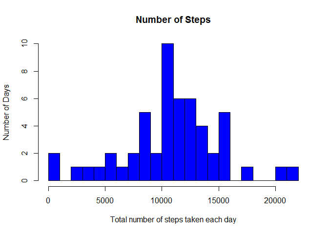
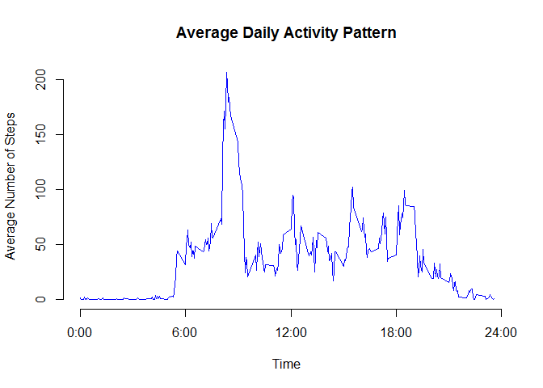

# Reproducible Research: Peer Assessment 1


## Loading and preprocessing the data
###1.Load the data (i.e. read.csv())


```r
data <- read.csv("activity.csv", header = T)   
```

###2.Process/transform the data (if necessary) into a format suitable for your analysis
create a subset with NA removed


```r
dataNaOmit <- subset(data, is.na(data$steps) == F)  
```

## What is mean total number of steps taken per day?
###1. Calculate the total number of steps taken per day & Make a histogram of the total number of steps taken each day
calculating the total number of steps taken each day


```r
library(plyr)  
totalPerDay <- ddply(dataNaOmit, .(date), summarise, steps=sum(steps))   
```

Make a histogram of the total number of steps taken each day


```r
hist(totalPerDay$steps, breaks = 20, main="Number of Steps", 
     xlab="Total number of steps taken each day", ylab = "Number of Days", col="blue")  
```

 

###2. Calculate and report the mean and median total number of steps taken per day
Mean


```r
     mean(totalPerDay$steps)  
```

```
## [1] 10766.19
```

Median


```r
     median(totalPerDay$steps)  
```

```
## [1] 10765
```


## What is the average daily activity pattern?
###1.Make a time series plot (i.e. type = "l") of the 5-minute interval (x-axis) and the average number of steps taken, averaged across all days (y-axis) 
calcluating the average number of steps taken in each 5-minite intervals


```r
averagePerInterval <- ddply(dataNaOmit, .(interval), summarise, steps=mean(steps))
plot(averagePerInterval$interval, averagePerInterval$steps,axes = F, type="l", col="blue", xlab="Time", ylab="Average Number of Steps",
     main="Average Daily Activity Pattern")
axis(1,at=c(0,600,1200,1800,2400), label = c("0:00","6:00","12:00","18:00","24:00"))
axis(2)
```

 

###2.Which 5-minute interval, on average across all the days in the dataset, contains the maximum number of steps?


```r
averagePerInterval[which.max(averagePerInterval$steps),]
```

```
##     interval    steps
## 104      835 206.1698
```

## Imputing missing values
###1. Calculate and report the total number of missing values in the dataset (i.e. the total number of rows with NAs)

```r
sum(is.na(data$steps))
```

```
## [1] 2304
```

###2.Devise a strategy for filling in all of the missing values in the dataset. The strategy does not need to be sophisticated.
I will fill the NA with average value for that 5-min interval   

###3. Create a new dataset that is equal to the original dataset but with the missing data filled in.


```r
imputed <- data

for (i in 1:nrow(imputed)){
    if (is.na(imputed$steps[i])){
        imputed$steps[i] <- averagePerInterval$steps[which(imputed$interval[i] == averagePerInterval$interval)]}
}

imputed <- arrange(imputed, interval)
```

###4.Make a histogram of the total number of steps taken each day and Calculate and report the mean and median total number of steps taken per day. Do these values differ from the estimates from the first part of the assignment? What is the impact of imputing missing data on the estimates of the total daily number of steps?


```r
totalPerDayImputed <- ddply(imputed, .(date), summarise, steps=sum(steps))
hist(totalPerDayImputed$steps, breaks = 20, main="Number of Steps", xlab="Total number of steps taken each day", ylab = "Number of Days", col="blue")
```

 

```r
mean(totalPerDayImputed$steps)
```

```
## [1] 10766.19
```

```r
median(totalPerDayImputed$steps)
```

```
## [1] 10766.19
```

```r
abs(mean(totalPerDay$steps)-mean(totalPerDayImputed$steps))
```

```
## [1] 0
```

```r
abs(median(totalPerDay$steps)- median(totalPerDayImputed$steps))/median(totalPerDay$steps)
```

```
## [1] 0.0001104207
```

```r
totalDifference <- sum(imputed$steps) - sum(dataNaOmit$steps)
totalDifference
```

```
## [1] 86129.51
```


## Are there differences in activity patterns between weekdays and weekends?
###1. Create a new factor variable in the dataset with two levels -- "weekday" and "weekend" indicating whether a given date is a weekday or weekend day.


```r
Sys.setlocale("LC_TIME", "English") 
```

```
## [1] "English_United States.1252"
```

```r
imputed$weekdays <- weekdays(as.Date(imputed$date))
imputed$weekdays <- ifelse(imputed$weekdays %in% c("Saturday", "Sunday"),"weekend", "weekday")
```

###2.Make a panel plot containing a time series plot (i.e. type = "l") of the 5-minute interval (x-axis) and the average number of steps taken, averaged across all weekday days or weekend days (y-axis). See the README file in the GitHub repository to see an example of what this plot should look like using simulated data.


```r
average <- ddply(imputed, .(interval, weekdays), summarise, steps=mean(steps))
library(lattice)
xyplot(steps ~ interval | weekdays, data = average, layout = c(1, 2), type="l", xlab = "Interval", ylab = "Number of steps")
```

 
